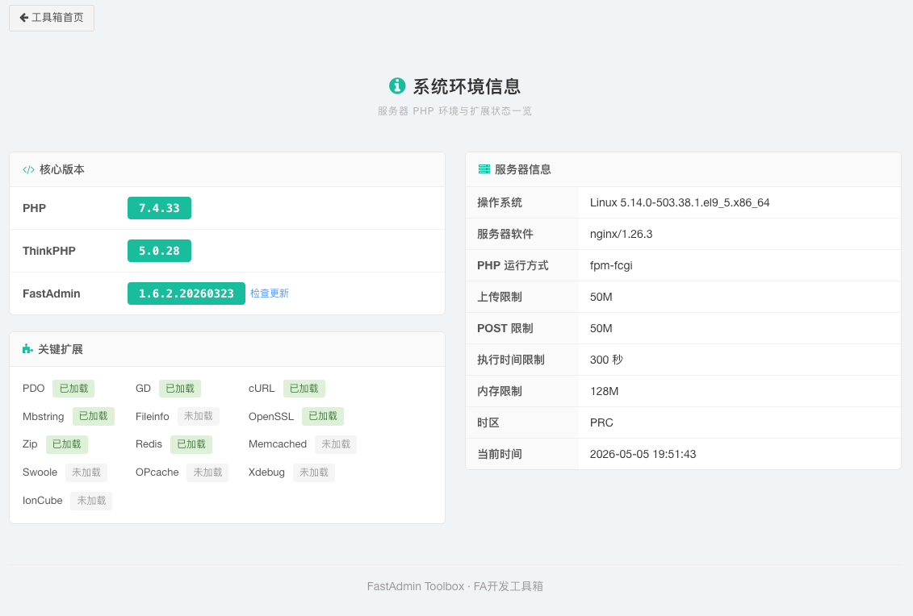
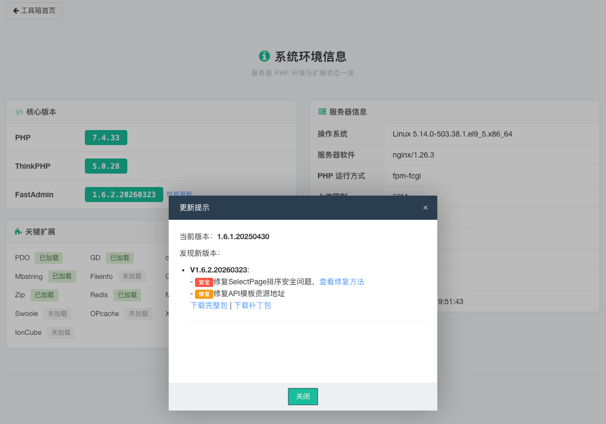

# FastAdmin Toolbox FA开发工具箱

> 这是为 FastAdmin 开发的一个工具集合单控制器工具箱，提供了各种实用功能，帮助开发者更高效地快速完成 FastAdmin 的基础配置、文档查询、应用开发及系统维护。

## 已实现功能

- **限制处于开发模式**：工具箱仅在 FastAdmin 处于开发模式（`app_debug` 配置项为 `true`）时，并以管理员身份登录时可用，确保生产环境的安全性。
- **工具箱面板**：提供一个统一的界面，展示所有工具的功能和状态，方便开发者管理和使用工具。**允许根据不同项目的安全需要使用不同的类名来防止可能出现的安全问题。**
- **本地插件安装**：支持离线部署，直接上传 FastAdmin 标准插件压缩包进行安装，无需官方身份验证。
- **系统环境信息**：提供一个界面显示服务器环境信息，包括 PHP 版本、已安装的扩展、服务器配置等，帮助开发者快速了解系统环境。**支持官方版本更新的对比检查功能，帮助开发者及时了解最新版本的变化和更新内容。**
- **速查手册**：提供开发常用的速查手册列表，帮助开发者快速找到所需功能的使用方法和示例代码。

## 使用说明

- 将 `Toolbox.php` 文件放置在 `application/admin/controller/` 目录下，访问 `/toolbox/index` 路径即可打开工具箱面板。
  - Linux 系统可以在项目根目录下通过`curl`或`wget`使用下面的命令进行下载部署：
  ```bash
  # 使用 curl 下载
  curl -o application/admin/controller/Toolbox.php https://raw.githubusercontent.com/frank6com/fastadmin_toolbox/master/Toolbox.php
  
  # 使用 wget 下载
  wget -O application/admin/controller/Toolbox.php https://raw.githubusercontent.com/frank6com/fastadmin_toolbox/master/Toolbox.php
  ```
- 访问内置页面：
  - **工具箱面板**：在后台管理地址后追加 `/toolbox/index` 路径访问即可打开工具箱面板查看可使用的工具。
  - **本地插件安装功能**：通过工具箱面板进入，或在后台管理地址后追加 `/toolbox/install` 路径访问即可使用本地插件安装功能，按照提示上传符合 FastAdmin 标准格式的插件压缩包进行安装。
  - **系统环境信息**：通过工具箱面板进入，或在后台管理地址后追加 `/toolbox/phpinfo` 路径访问即可查看系统环境信息，包括服务器配置、PHP 版本、已安装的扩展等。

## 注意事项

- 请确保上传的插件压缩包符合 FastAdmin 标准格式，以避免安装失败。
- 本工具仅适用于 FastAdmin 框架，其他框架可能无法正常使用。
- 使用本工具进行插件安装时，请确保服务器具有足够的权限和资源，以避免安装过程中出现权限或资源不足的问题。
- 建议在使用本工具前备份重要数据，以防止意外情况导致数据丢失。
- 本工具仅提供插件安装功能，不包含插件的开发、调试或其他相关功能。
- 本工具的使用可能会涉及到服务器安全问题，请确保上传的插件来源可靠，以避免潜在的安全风险。

## 界面预览






## 交流 QQ 群

群号：[9735629](https://qm.qq.com/q/VB9i1gS56a) （可点击链接加入）


## 未来计划

- 系统设置初始化器：设定后自动初始化系统设置的功能，帮助开发者快速完成系统配置.
- 菜单导出器：将系统菜单导出为目标格式，方便备份和迁移.
- 菜单导入器：从目标格式导入系统菜单，快速恢复或迁移菜单配置.
- 常用功能库速查手册：提供常用功能实现的速查手册，帮助开发者快速找到所需功能的使用方法和示例代码.


