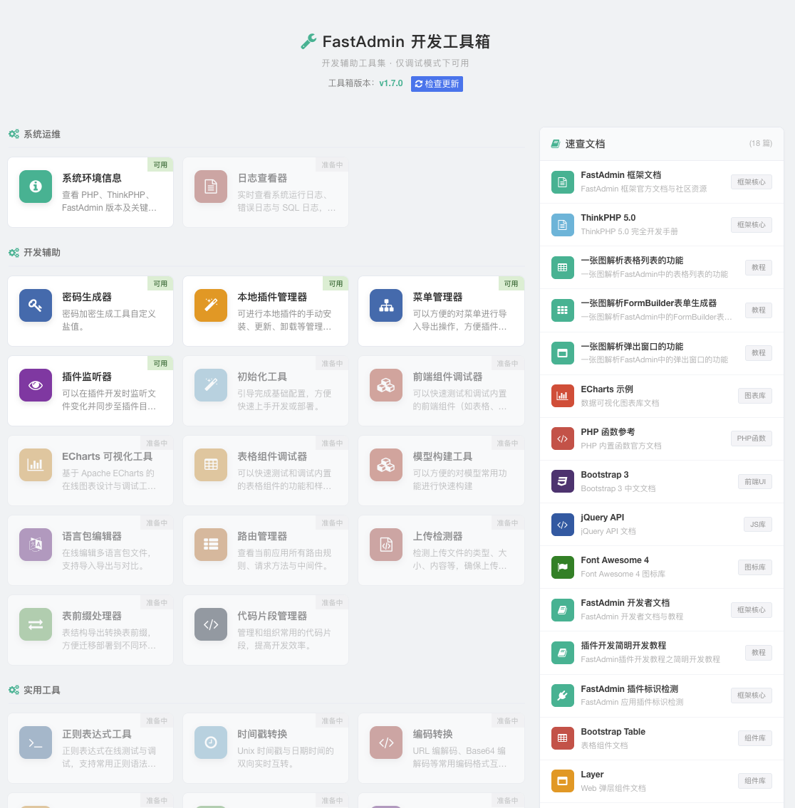
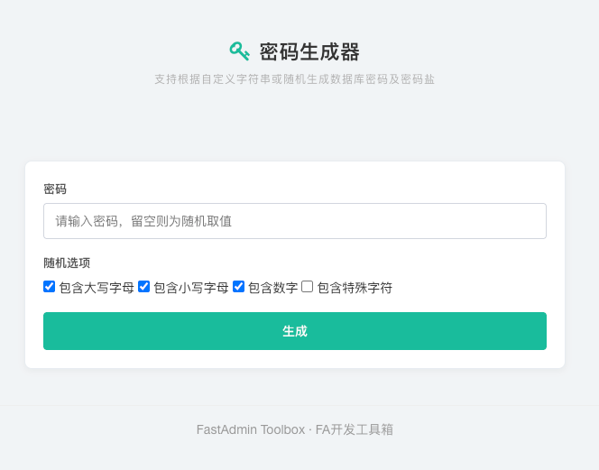
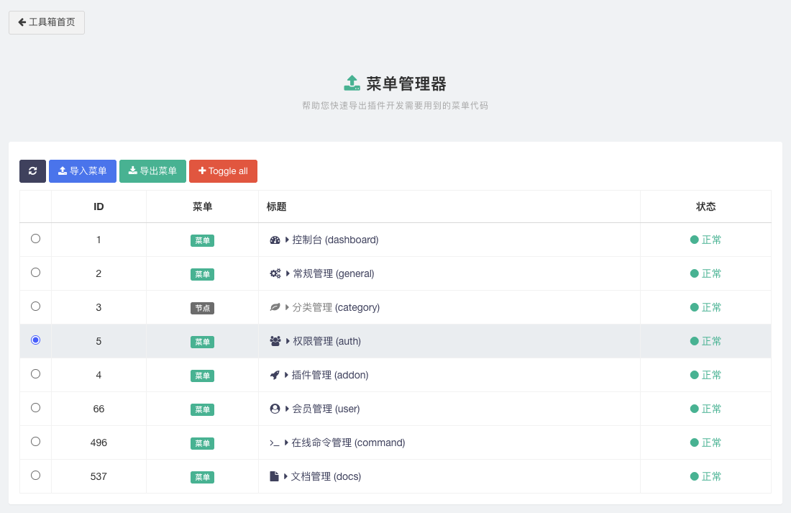
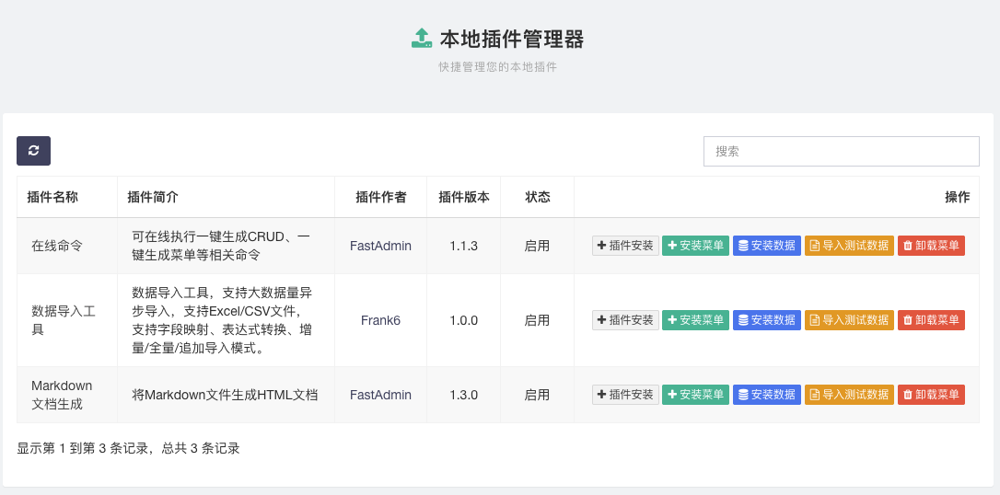
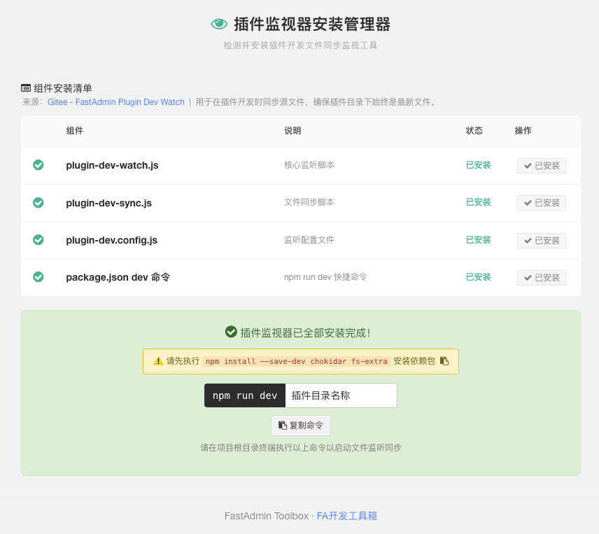

# FastAdmin Toolbox 开发工具箱

> 这是为 FastAdmin 以单控制器方式实现的开发常用工具集，提供了各种实用功能，帮助开发者更高效地快速完成 FastAdmin 的基础配置、文档查询、应用开发及系统维护。



---

## 已实现功能

| 功能模块 | 说明 |
|---------|------|
| **限制处于开发模式** | 工具箱仅在 FastAdmin 处于开发模式（`app_debug` 为 `true`）且管理员登录时可用，确保生产环境安全 |
| **工具箱面板** | 统一界面展示所有工具功能与状态，支持自定义类名防止安全问题，增加自更新功能 |
| **系统环境信息** | 展示 PHP 版本、已安装扩展、服务器配置等，支持官方版本更新对比检查 |
| **速查手册** | 提供开发常用速查手册列表，快速定位使用方法与示例代码 |
| **密码生成器** | 支持自定义字符串或随机生成管理员密码及密码盐 |
| **本地插件管理器** | 显示本地插件列表，支持安装/卸载菜单、导入数据等二次开发操作 |
| **菜单代码管理器** | 支持菜单配置与代码的双向导入导出，快速创建或备份菜单配置 |
| **插件开发监听器安装器** | 检测并安装插件开发文件同步监视工具，安装后可通过命令行执行生产目录和插件目录的文件监听同步功能 |

## 使用说明

### 安装部署

将 `Toolbox.php` 放入 `application/admin/controller/` 目录即可。在项目根目录下可通过 `curl` 或 `wget` 一键下载：

```shell
# 使用 curl 下载
curl -o application/admin/controller/Toolbox.php https://raw.githubusercontent.com/frank6com/fastadmin-toolbox/master/Toolbox.php
```

```shell
# 使用 wget 下载
wget -O application/admin/controller/Toolbox.php https://raw.githubusercontent.com/frank6com/fastadmin-toolbox/master/Toolbox.php
```

### 访问页面

| 页面 | 路径 | 说明 |
|------|------|------|
| **工具箱面板** | `/toolbox/index` | 查看所有可用工具 |
| **系统环境信息** | `/toolbox/phpinfo` | 查看服务器配置、PHP 版本、已安装扩展等 |

## 注意事项

- 本工具仅适用于 FastAdmin 框架，其他框架可能无法正常使用。
- 建议在使用本工具前备份重要数据，以防止意外情况导致数据丢失。
- 本工具的使用可能会涉及到服务器安全问题，请确保上传的插件来源可靠，以避免潜在的安全风险。

## 界面预览

| | |
|:---:|:---:|
|  |  |
| *工具箱首页* | *密码生成器* |
|  |  | 
| *系统环境信息* | *系统环境信息 - 检查更新* |
|  |  |
| *菜单代码管理器* | *本地插件管理器* |
|  |  |
| *插件开发监听器* |   |

## 交流 QQ 群

群号：[9735629](https://qm.qq.com/q/VB9i1gS56a) （可点击链接加入）


## 未来计划

### 🔧 系统运维

| 功能 | 说明 |
|------|------|
| **系统环境信息更新** | 增加伪静态配置查看、PHP 版本兼容性检查、目录权限检查 |
| **系统初始化向导** | 引导完成初始配置（伪静态、PHP 兼容性、目录权限、Nginx 配置等），减少搭建问题 |
| **日志查看器** | 显示系统及 ThinkPHP 日志内容，方便调试 |

### 🧩 开发辅助

| 功能 | 说明 |
|------|------|
| **模型辅助工具** | 展示模型定义与示例（`relationSearch`、`selectpage` 配置、枚举值等） |
| **表格生成器** | 输入配置自动生成表格代码 |
| **selectpage 工具** | `selectpage` 配置与使用示例展示 |
| **上传/OSS 配置检测** | 检查上传相关配置项及其当前值 |
| **代码片段管理器** | 连接预设服务器获取常用代码片段，支持自定义保存 |
| **路由配置工具** | 可视化路由配置管理 |
| **requireJS 配置工具** | requireJS 模块配置辅助 |
| **表前缀 SQL 转换器** | 自动转换 SQL 语句中的表前缀适配不同环境 |
| **前端组件调试工具** | 展示前端代码及组件预览，探索低代码编辑器的可能性 |
| **常见问题解答** | 常见问题及解决方案汇总 |

### 🔄 实用工具

| 功能 | 说明 |
|------|------|
| **时间戳转换器** | 时间戳与日期时间格式互转 |
| **正则表达式测试工具** | 输入正则与测试字符串，实时显示匹配结果 |
| **图转 Base64 工具** | 上传图片自动转换为 Base64 编码 |
| **编码转换工具** | 输入文本选择目标编码格式自动转换 |
| **WebSocket 调试工具** | 展示 WebSocket 连接状态与消息内容 |


---

## 写在最后

> 还记得你当年玩游戏的秘技是什么吗？